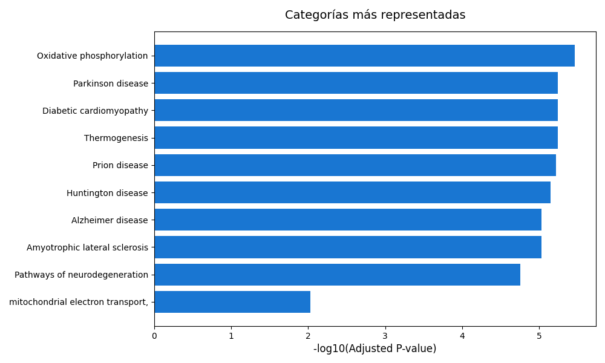

# 💻 🧬 Tarea 1: Análisis funcional de genes

Este proyecto propone un análisis funcional de sobrerrepresentación (**ORA**, _Over-Representation Analysis_) de los genes **COX4I2**, **ND1** y **ATP6**.
Este tipo de análisis estadístico busca determinar si ciertos genes aparecen con mayor frecuencia dentro de una categoría funcional específica (por ejemplo, un proceso biológico, una vía metabólica o una enfermedad) de lo que cabría esperar por azar.
Para ello, se emplea la prueba exacta de Fisher, una herramienta estadística que evalúa si existe una asociación significativa entre dos variables categóricas —en este caso, los genes de interés y las categorías funcionales a las que pertenecen—.
Se utiliza un nivel de significancia convencional de _p_ < 0.05, lo que significa que valores menores a ese umbral indican una asociación estadísticamente significativa, es decir, que la aparición de esos genes en dicha categoría no sería producto del azar, sino que podría reflejar una relación biológica real.

Este repositorio contiene un script de Python que utiliza la librería [GSEApy](https://gseapy.readthedocs.io/),
así como distintas bases de datos biológicas,
para identificar procesos biológicos, funciones moleculares y enfermedades asociadas a los genes de interés.

____

### 🔍 Bases de datos utilizadas

Se utilizan las siguientes bases de datos para el análisis, que ofrecen un enfoque complementario:

- **GO_Biological_Process_2021**: forma parte de la Gene Ontology (GO), una base de datos que clasifica la información sobre genes y proteínas. En este caso, describe los procesos biológicos
en los que participan los genes.

- **KEGG_2021_Human**: proviene del Kyoto Encyclopedia of Genes and Genomes (KEGG), una base de datos que representa las rutas metabólicas y de señalización del organismo humano, mostrando cómo interactúan los genes y proteínas dentro de sistemas biológicos.

- **Reactome_2022**: recopila reacciones metabólicas y vías moleculares del genoma humano, con anotaciones curadas manualmente por expertos a partir de evidencia experimental.

> 💡 Estas bases se usan por defecto, pero pueden modificarse con el parámetro de ejecución `--databases`.

## 📁 Estructura del repositorio

```
/analisis-funcional/
├── data/
│   └── genes_input.txt        # Genes de entrada del análisis
├── analisis_funcional.py      # Script que ejecuta el análisis funcional
├── results/                   # Resultados generados por el script
├── README.md                  
└── requirements.txt           
```

## 🚀 Manual de uso

Clonar el repositorio y ejecutar el script principal:

```
git clone https://github.com/srozenblum/HAB_tarea-1 analisis_funcional
cd analisis_funcional
pip install -r requirements.txt
python analisis_funcional.py --input data/genes_input.txt --graficar
```

Parámetros de ejecución:

| Parámetro      | Descripción                                                                    | Opcional | Valor por defecto                                            |
|----------------|--------------------------------------------------------------------------------|----------|--------------------------------------------------------------|
| `--input_file` | Ruta al archivo de texto con los genes a analizar.                             | ❌       | -                                                            |
| `--output_dir` | Directorio raíz donde se guardarán todos los resultados del flujo.             | ✅        | `results/`                                                   |
| `--databases`  | Bases de datos a emplear en el análisis funcional ORA (separadas por espacio). | ✅       | `GO_Biological_Process_2021, KEGG_2021_Human, Reactome_2022` |
| `--graficar`   | Generar gráfica de barras para sintetizar los resultados.                      | ✅       | `False`                                                      |


## 📊 Resultados

Los resultados se guardan automáticamente en el directorio especificado mediante el parámetro `--output_dir` (por defecto, `results/`) e incluyen:

- `enrichment_results.csv`:  tabla con las categorías funcionales enriquecidas, sus _p_-valores y los genes asociados.
- `enrichment_plot.png`: gráfica de barras que resume las categorías más significativas (opcional, generado con `--graficar`).

Por ejemplo, para la ejecución con los parámetros por defecto se obtiene la siguiente gráfica:



En la gráfica se muestran los procesos biológicos más representados entre los genes analizados.
En el eje horizontal se observa la significancia estadística (valor de _p_ ajustado en escala logarítmica), donde barras más largas indican asociaciones más fuertes.
Los términos con mayor relevancia —fosforilación oxidativa, termogénesis y miocardiopatía diabética— apuntan a funciones mitocondriales y metabólicas, coherentes con los genes COX4I2, ND1 y ATP6, todos implicados en la producción de energía (ATP).
También se identifican enfermedades neurodegenerativas (Parkinson, Alzheimer, Huntington), que comparten alteraciones en las rutas mitocondriales, reforzando la relación funcional entre los genes y el metabolismo energético.

## ⚙️ Dependencias

Las librerías necesarias para ejecutar el análisis se encuentran en `requirements.txt`:

```
gseapy
pandas
numpy
matplotlib.pyplot
```

Instalación rápida:
```
pip install -r requirements.txt
```

## 📚 Referencias
- Subramanian et al., _Gene Set Enrichment Analysis: A knowledge-based approach for interpreting genome-wide expression profiles._ (PNAS, 2005)
- Kanehisa et al., _KEGG: Kyoto Encyclopedia of Genes and Genomes._ (Nucleic Acids Res. 2000)