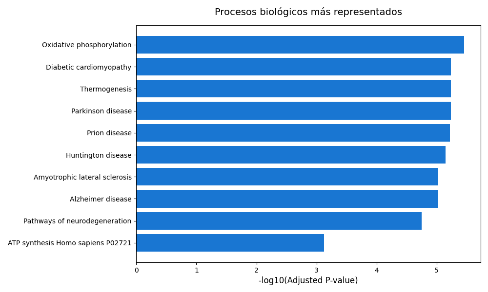

# 💻 🧬 Tarea 1: Análisis Funcional de genes

Este proyecto propone un análisis funcional de los genes **COX4I2**, **ND1** y **ATP6** mediante un análisis de sobrerrepresentación.
Este tipo de análisis estadístico busca determinar si ciertos genes aparecen con mayor frecuencia dentro de una categoría funcional específica (por ejemplo, un proceso biológico, una vía metabólica o una enfermedad) de lo que cabría esperar por azar.
Para ello, se emplea la prueba exacta de Fisher, una herramienta estadística que evalúa si existe una asociación significativa entre dos variables categóricas —en este caso, los genes de interés y las categorías funcionales a las que pertenecen—.
Se utiliza un nivel de significancia convencional de _p_ < 0.05, lo que significa que valores menores a ese umbral indican una asociación estadísticamente significativa, es decir, que la aparición de esos genes en dicha categoría no sería producto del azar, sino que podría reflejar una relación biológica real.

Este repositorio contiene un script de Python que utiliza la librería [GSEApy](https://gseapy.readthedocs.io/),
así como distintas bases de datos biológicas,
para identificar procesos biológicos, funciones moleculares y enfermedades asociadas a los genes de interés.

____

### 📁 Bases de datos utilizadas

- **GO_Biological_Process_2021**: forma parte de la Gene Ontology (GO), una base de datos que clasifica la información sobre genes y proteínas. En este caso, describe los procesos biológicos
en los que participan los genes, como la división celular, la respuesta inmune o la apoptosis.

- **GO_Molecular_Function_2021**: también parte de Gene Ontology, agrupa las funciones moleculares que desempeñan las proteínas, por ejemplo, la unión a un receptor o la actividad enzimática.

- **GO_Cellular_Component_2021**: tercera categoría de Gene Ontology, que indica dónde actúan las proteínas dentro de la célula, como el núcleo, la membrana o el citoesqueleto.

- **KEGG_2021_Human**: proviene del Kyoto Encyclopedia of Genes and Genomes (KEGG), una base de datos que representa las rutas metabólicas y de señalización del organismo humano, mostrando cómo interactúan los genes y proteínas dentro de sistemas biológicos

- **Reactome_2022**: recopila reacciones metabólicas y vías moleculares del genoma humano, con anotaciones curadas manualmente por expertos a partir de evidencia experimental.

- **Panther_2016**: parte del proyecto PANTHER (Protein ANalysis THrough Evolutionary Relationships), que clasifica genes y proteínas según su función, familia evolutiva y participación en rutas metabólicas.

- **BioCarta_2016**: colección clásica de vías de señalización en humanos, que describe cómo las moléculas interactúan dentro de las células para regular procesos como el crecimiento, la inflamación o la apoptosis.

> 💡 Estas bases se usan por defecto, pero pueden modificarse editando 
la variable `databases` en el script.

## 📋 Estructura del repositorio

```
/analisis-funcional/
├── data/
│   └── genes_input.txt        # Genes de entrada del análisis
├── analisis_funcional.py  # Script que ejecuta el análisis funcional
├── results/                   # Resultados generados por el script
├── README.md                  
└── requirements.txt           # Dependencias del proyecto
```

## 🚀 Manual de uso

```
git clone https://github.com/srozenblum/HAB_tarea-1 analisis_funcional
cd analisis_funcional
python analisis_funcional.py --input data/genes_input.txt --output results.txt --graficar
```

Parámetros de ejecución:

`--input`: archivo de texto con los genes a analizar.

`--output`: directorio donde se guardarán los resultados.

`--graficar`: genera una figura resumen de los resultados (opcional).

## 📊 Resultados

Los resultados se guardan en la carpeta `results/` e incluyen:

- `results.txt`:  tabla con las categorías funcionales enriquecidas, sus _p_-valores y los genes asociados.
- `grafica_resultados.png`: Gráfico de resumen de las categorías más significativas (opcional, generado con `--graficar`).

Por ejemplo, para la ejecución con los parámetros por defecto se obtiene la siguiente gráfica:



En la gráfica se muestran los procesos biológicos más representados entre los genes analizados.
En el eje horizontal se observa la significancia estadística (valor de _p_ ajustado en escala logarítmica), donde barras más largas indican asociaciones más fuertes.
Los términos con mayor relevancia —fosforilación oxidativa, termogénesis y miocardiopatía diabética— apuntan a funciones mitocondriales y metabólicas, coherentes con los genes COX4I2, ND1 y ATP6, todos implicados en la producción de energía (ATP).
También se identifican enfermedades neurodegenerativas (Parkinson, Alzheimer, Huntington), que comparten alteraciones en las rutas mitocondriales, reforzando la relación funcional entre los genes y el metabolismo energético.

## ⚙️ Dependencias

Las librerías necesarias para ejecutar el análisis se encuentran en `requirements.txt`:

```
gseapy
pandas
numpy
matplolib.pyplot
```

Instalación rápida:
```
pip install -r requirements.txt
```

## 📚 Referencias
- Subramanian et al., _Gene Set Enrichment Analysis: A knowledge-based approach for interpreting genome-wide expression profiles._ (PNAS, 2005)
- Kanehisa et al., _KEGG: Kyoto Encyclopedia of Genes and Genomes._ (Nucleic Acids Res. 2000)
En la cual se observa que los procesos biológicos asociados a los genes con 
mayor nivel de significancia estadística son la fosforilación oxidativa y la termogénesis,
y las enfermedades, miocardiopatía diabética y Parkinson.

PONER GRÁFICA Y DESCRIBIRLA.

## ⚙️ Dependencias

Las librerías necesarias para ejecutar el análisis se encuentran en `requirements.txt`:

```
gseapy
pandas
numpy
matplotlib.pyplot
```

Instalación rápida:
```
pip install -r requirements.txt
```

## 📚 Referencias
- Subramanian et al., _Gene Set Enrichment Analysis: A knowledge-based approach for interpreting genome-wide expression profiles._ (PNAS, 2005)
- Kanehisa et al., _KEGG: Kyoto Encyclopedia of Genes and Genomes._ (Nucleic Acids Res. 2000)